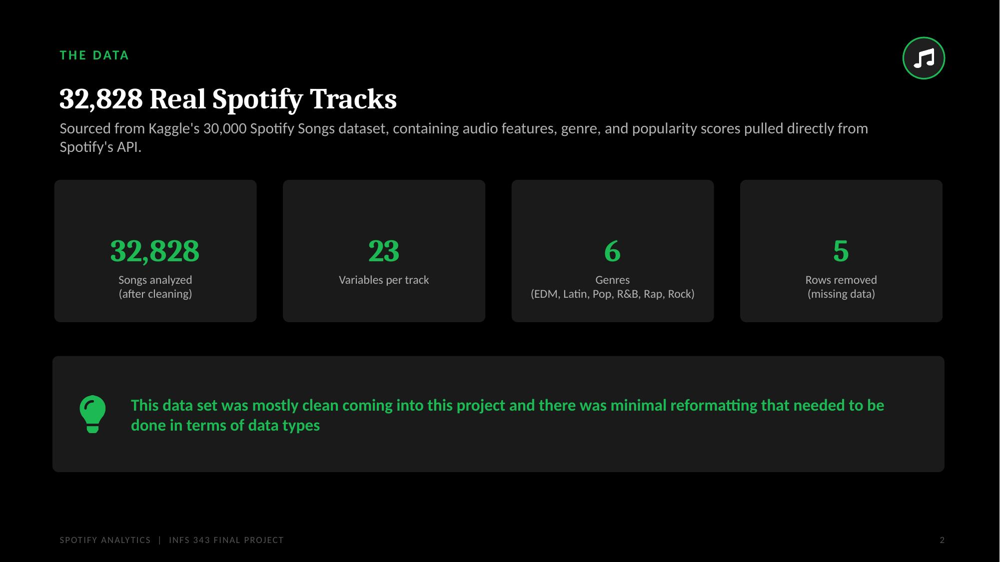
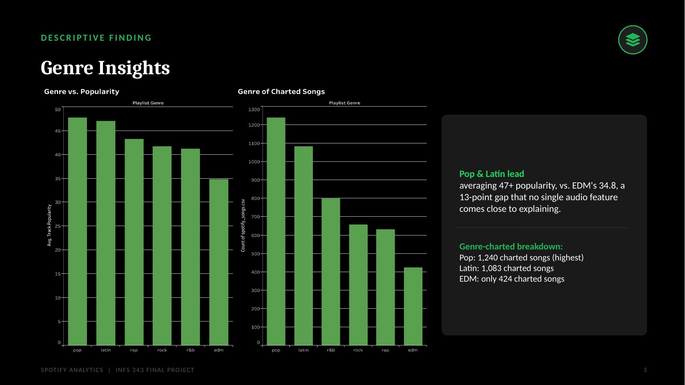
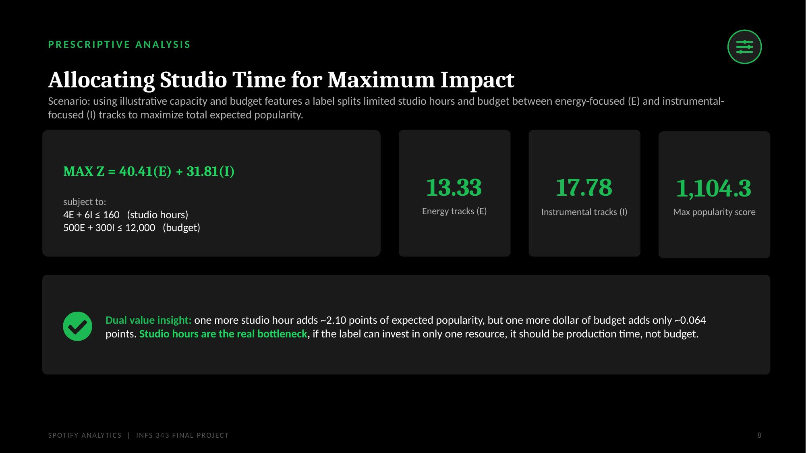
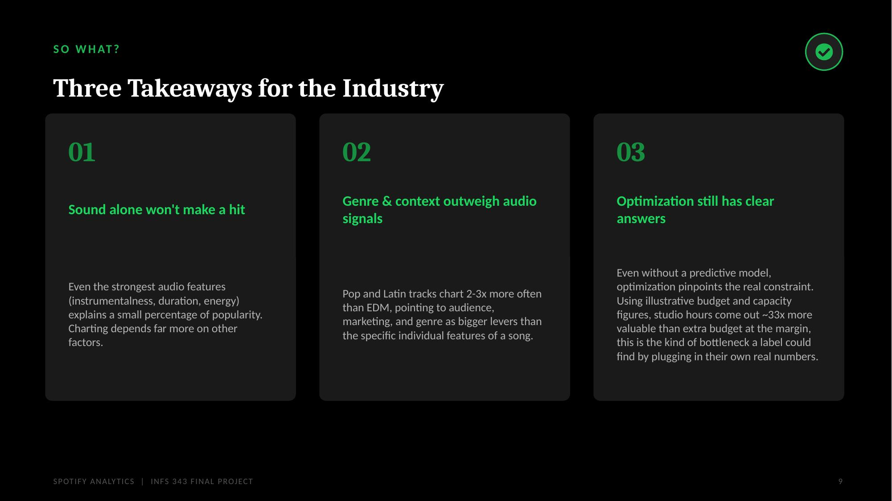

# Does Sound Predict Success? A Data-Driven Investigation into What Makes a Spotify Track Chart

**Fareeha Ahmad** · INFS 343 – Business Analytics Final Project

A data analytics project exploring whether audio features (energy, danceability, instrumentalness, etc.) can predict whether a Spotify track "charts" — and what actually separates hits from the rest.

---

## The Data

**32,828 real Spotify tracks**, sourced from Kaggle's 30,000 Spotify Songs dataset, spanning 23 variables per track across 6 genres (EDM, Latin, Pop, R&B, Rap, Rock). The dataset came in mostly clean, requiring minimal reformatting.

Since Spotify doesn't track Billboard-style chart status, this project defines its own threshold:

> **charted = track_popularity ≥ 70**

Only ~15% of songs meet this bar — a class imbalance that becomes important later in the predictive modeling.

## Genre Matters More Than Sound

Across every audio feature tested (acousticness, loudness, danceability, tempo, energy, and more), correlation with popularity never rose above a weak **0.15**. Genre, on the other hand, showed a clear pattern: **Pop and Latin tracks average 47+ popularity, a 13-point gap over EDM's 34.8** — a gap no single audio feature comes close to explaining. Pop tracks charted almost 3x as often as EDM tracks (1,240 vs. 424).

A decision tree trained on the three strongest predictors (instrumentalness, energy, duration) found **no meaningful split** — it never predicted "charted" for a single track, landing at 85.1% accuracy that's barely above the 85.3% baseline of always guessing "no."

## Where Should a Label Invest?

Using an illustrative linear program to allocate limited studio hours and budget between energy-focused and instrumental-focused tracks, the optimal split favors energy tracks. The more interesting result is in the **dual values**: one additional studio hour is worth **~2.10 points** of expected popularity, while one additional dollar of budget is worth only **~0.064 points**. **Studio hours, not budget, are the real bottleneck** — a pattern a label could test against their own numbers.

## Key Takeaways

1. **Sound alone won't make a hit.** Even the strongest audio features explain only a small share of popularity.
2. **Genre and context outweigh audio signals.** Pop and Latin tracks chart 2–3x more often than EDM, pointing to audience and marketing as bigger levers than any individual feature.
3. **Optimization still finds clear answers**, even without a strong predictive model — studio hours came out ~33x more valuable than extra budget at the margin.

---

## Full Materials

- [Full presentation (PDF)](slides/Spotify_Analysis_Presentation.pdf)
- Analysis code & write-up: see the R Markdown file in this repo
